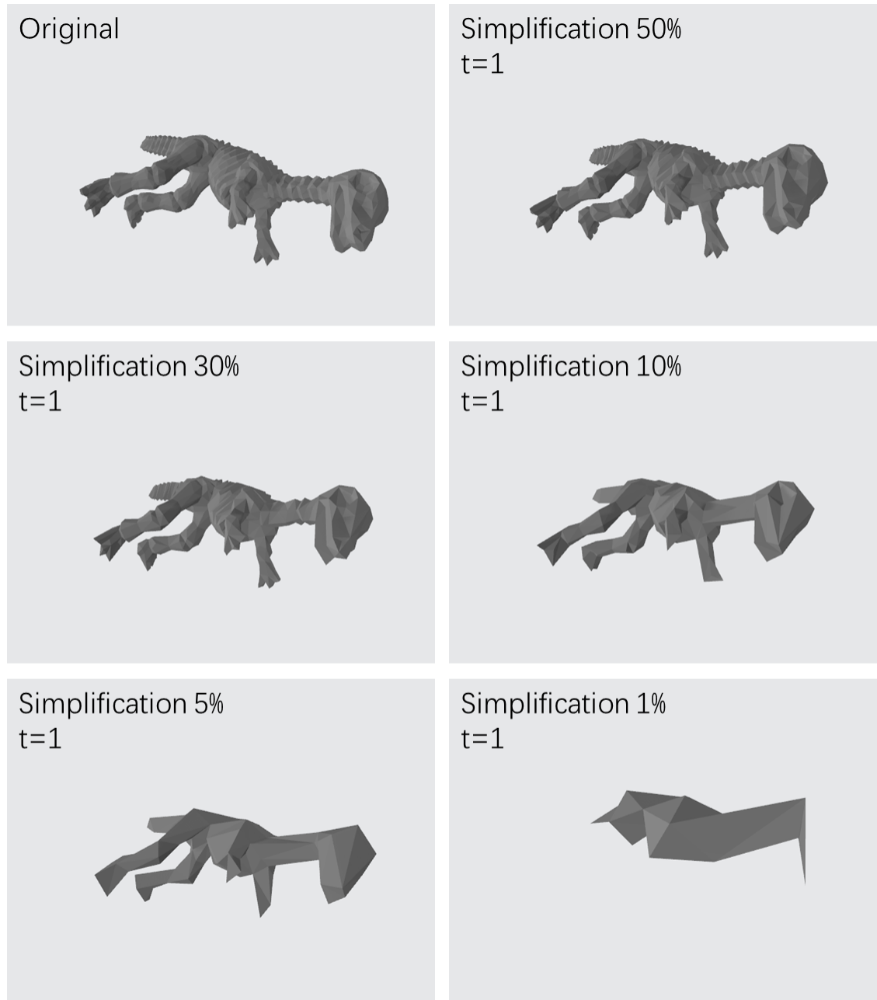

# Mesh simplification using python
An implementation of mesh simplification algorithm ([1]) using python



## Requirement
python 3.7, numpy, and argparse.

## How to run the code
```python mesh_simplify.py -i [input file path] -o [output file path] -r [simplification ratio (0~1)] -t [threshold parameter]```

For example:

```python mesh_simplify.py -i models/dinosaur.obj -o dinosaur_simp_10_0.obj -r 0.1 -t 0```

Please see [Guide.pdf](Guide.pdf) for a detailed introduction of the code.

[1] Garland, Michael, and Paul S. Heckbert. "Surface simplification using quadric error metrics." Proceedings of the 24th annual conference on Computer graphics and interactive techniques. ACM Press/Addison-Wesley Publishing Co., 1997.

mesh_simplify:
    self.t = threshold
    self.ratio = simplify_ratio
class_3d_model:

    1.读取模型(load_obj_file)
        self.points:(x,3)  row:vertexIndex column:xyz  无冗余的顶点坐标
        self.faces: (x,3)  row:faceIndex column:vertexIndex  3 : 三角面片的顶点索引 无冗余的面列表
        self.number_of_points: 顶点数量
        self.number_of_faces: 面数量
        self.edges: (x,2) row:edgeIndex column:vertexIndex  线数量

    2.计算平面(三角面片)方程(系数)
        self.plane_equ_para:  (self.number_of_faces ,4) row:面的数量, column:4 (a, b, c, d)

    3.计算出所有点的Q矩阵
        self.Q_matrices: (4,4)  将所有与该点相关的面的 Kp 矩阵进行叠加的结果
class_mesh_simplify:

    1.生成点对(generate_valid_pairs)
        self.dist_pairs: (x, 2)  row: valid_pairs_len column:startVertex and endVertex
        self.valid_pairs：(x, 2)  row: 去重==>valid_pairs_len + len(edge) 
        column:startVertex and endVertex

    2.计算优化点对收缩和成本(calculate_optimal_contraction_pairs_and_cost)
        self.v_optimal（优化顶点）:(len(self.valid_pairs),3) row: valid_pairs_len 
        column:表示最优收缩目标的坐标
        self.cost(优化成本): 一维数组
        self.new_point: (1,3) column:表示最优收缩目标的坐标  最优的收缩顶点坐标
        self.new_valid_pair: (1,2) column:startVertex and endVertex   最小成本的点对
    3.迭代移除最小cost对应的点对(iteratively_remove_least_cost_valid_pairs)
        self.new_point_count: init :0
        self.status_points: 0 means no change, -1 means the point is deleted
        self.status_faces: 0 means no change, -1 means the point is deleted
        3.1. 更新面参数(self.update_plane_equation_parameters(v_1_2_in_faces_loc))
            3.1.1. 更新单独面的参数
            (self.calculate_plane_equation_for_one_face(point_1, point_2, point_3))
        3.2. 更新Q矩阵(self.update_Q(current_valid_pair-1, v_1_location))
            
        3.3. 更新有效点对和成本(self.update_valid_pairs_v_optimal_and_cost(v_1_location))
            更新：self.valid_pairs = self.valid_pairs[unique_valid_pairs_loc, :]
                self.v_optimal = self.v_optimal[unique_valid_pairs_loc, :]
                self.cost = self.cost[unique_valid_pairs_loc]
        3.4. 更新最优收缩点对和成本(self.update_optimal_contraction_pairs_and_cost(v_1_location)
            计算收缩后点的成本
)